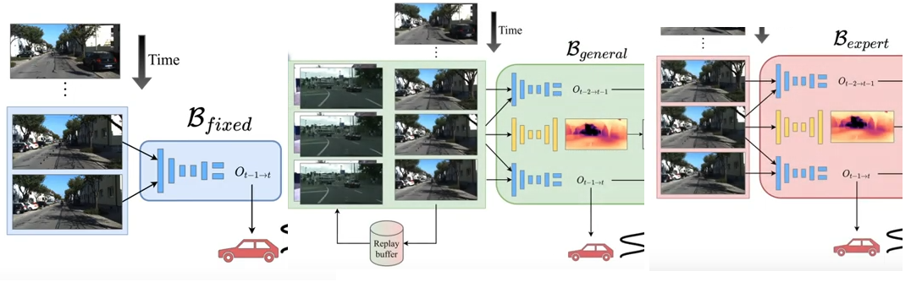
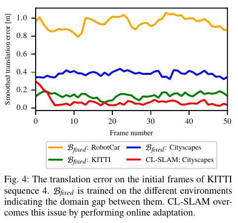
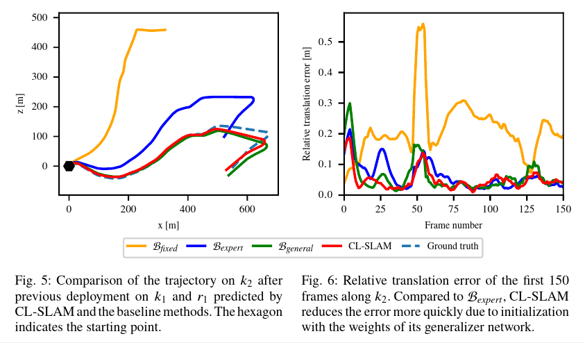
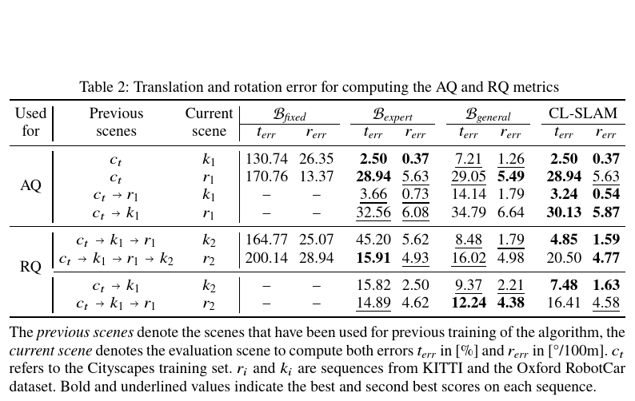
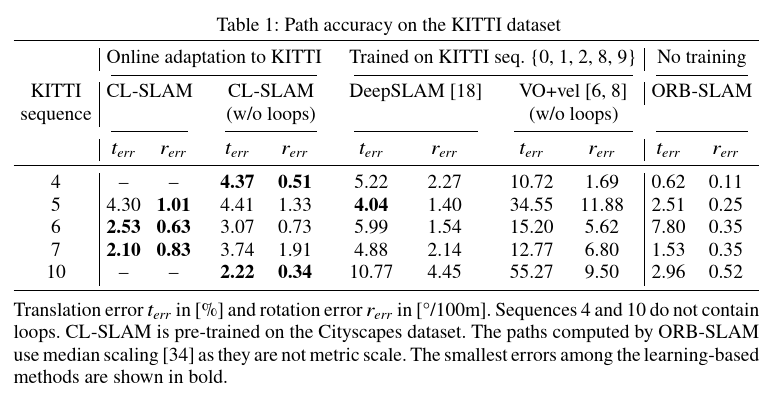

class: center, middle

# Reviewing CL-SLAM

Niclas Vödisch, Daniele Cattaneo, Wolfram Burgard, and Abhinav Valada

"Beyond Lifelong Simultaneous Localization and Mapping through Continual Learning"

IEEE/CVF Conference on Computer Vision and Pattern Recognition (CVPR) Workshops, 2023.

[arXiv:2203.01578](https://arxiv.org/abs/2203.01578)

---

# Content

0. About me

1. Motivation

2. Goals

3. Proposed Solution
   * Architecture
   * Implementation

4. Evaluation

5. Review

6. Further Notes

---

# About me

Konstantin Heil

* born 1984 in Frunse (former SR, now Kirghistan)
* moved 1992 to Germany
* 2005 - 2011 Studying Physics and Math in Heidelberg
  * Programming in C++ and MATLAB for fun and studies
* 2011 - 2017 PhD in Differential Geometry in Stuttgart
  * Programming in Haskell for student and grade management
  * Teaching numerical methods using MATLAB to students
* 2017 - June 2023 Software Engineer at FARO
  * Programming C++, JavaScript / TypeScript, PowerShell for fun and profit
  * Working on a big, old (>20y) code base dealing with 3D point cloud data
  * Focusing on point cloud registration and scan data registration workflows
* April - June 2023 Studying Machine- and Deep Learning
  * Programming in Python, using SciKit-Learn and Tensorflow

---

# Motivation

Challenges in SLAM

* Handcrafted low-level features tend to fail in challenging conditions

* DL based approaches lack the ability to generalize

* Domain gap between environments

* Sudden changes to an environment

---

## Motivation and Definitions

* Environment := Bounded geographical area

* Lifelong SLAM := Constrained to stay within a (changing) environment

* Domain Adaption := Uni-directional knowledge transfer between environments

---

# Goals

1. React to sudden changes without interrupting operation

2. Adapt to new environments without ground truth data in a unsupervised or self-supervised manner

3. Deploy to many unknown environments and leverage this knowledge when revisiting previous deployments

---

# Proposed Solution

Continual Learning and Lifelong SLAM (CL-SLAM); leverages

## Related work

[cff p.3]

* SfMLearner and Monodepth2: Self-supervised visual odometry and depth estimation
* DeepSLAM: Unsupervised VO with pose graph optimization and loop closure
* CoMoDA: Using a replay buffer to "incorporate the experience from the distant past"

---

## Architecture

[cff p.7]

* Expert performs online adaption and predicted results are sent to the SLAM framework (like Monodepth2)
* Generalizer avoids catastrophic forgetting employing a replay buffer of seen samples (like CoMoDA)
* Generalizer and Expert have own independent instances of depth- and pose-network (one each) (**new**)

---

## Implementation

* [depth_pose_prediction.py](https://github.com/robot-learning-freiburg/CL-SLAM/blob/main/depth_pose_prediction/depth_pose_prediction.py): Dual network architecture (self.models / self.online_models)
* [pose_decoder.py](https://github.com/robot-learning-freiburg/CL-SLAM/blob/main/depth_pose_prediction/networks/pose_decoder.py)
  * Pose network with velocity supervision
  * Adopted from Monodepth2
  * Encoder based on ResNet
* [depth_decoder.py](https://github.com/robot-learning-freiburg/CL-SLAM/blob/main/depth_pose_prediction/networks/depth_decoder.py)
  * Predicts disparity / inverse depth
  * Adopted from Monodepth2
  * Encoder based on ResNet
* [loop_closure_detection.py](https://github.com/robot-learning-freiburg/CL-SLAM/blob/main/loop_closure_detection/loop_closure_detection.py)
  * Builds index using [faiss](https://faiss.ai/)
  * Encoder based on mobilenet_v3_small (pre-trained)
* [replay_buffer.py](https://github.com/robot-learning-freiburg/CL-SLAM/blob/main/slam/replay_buffer.py)
  * Maintains collection of dissimilar samples
  * Uses own instance of loop closure's encoder and index
  * This might be an extensions of the authors' next paper: [CoVIO](https://arxiv.org/abs/2303.10149)
* [pose_graph_optimization.py](https://github.com/robot-learning-freiburg/CL-SLAM/blob/main/slam/pose_graph_optimization.py) (based on g2o.SparseOptimizer)
* Data flow in one step of the SLAM framework [see step.png](img/step.png)

---

### Training and Initialization

[cff p.8]

1. At time t, use the latest three images and velocity measurements
2. Predict pose between each sub-sequent pair
3. Predict depth estimate for image at time t-1
4. Generate loss and use back-propagation to update weights
   * [cf p.18], same as Monodepth2, CoMoDA and others
   * total loss ~ photometric loss + smoothing loss + velocity loss
   * photometric loss ~ masked, structured similarity index of re-projected and source images
   * smoothing loss ~ l1-norm of disparity map's gradient
   * velocity loss ~ l2-norm of estimated translation and estimated motion based on velocity
5. Loop over steps (2) to (4) (5 times for CL-SLAM, [cf p.15])
6. Advance time step and start at (1)

* At deployment, the Expert network is initialized with the weights from the Generalizer.
* At first deployment, the Generalizer is initialized from pre-training.

---

# Evaluation

* Bfixed utilizes frozen weights after the pre-train stage without online adaption
* Bexpert continuously updates weights without reset after redeployment
* Bgeneral leverages replay buffer without the expert network

## Datasets

* 'c' stands for a scene from Cityscapes
* 'k' stands for a scene from KITTI
* 'r' stands for a scene from RobotCar

---

## Impact of the Expert Network

[cf p.12]

---

## Necessity of the Generalizer Network

[cf p.13]

---

## Adaption- and Retention Quality

[cf p.11]

---

## Comparison with Prior Art

[cf p.10]

---

# Review

## Goals

1. React to sudden changes without interrupting operation
   * No complete evidence given, how this goal was achieved.
   * When or how-to to re-initialize the expert without downtime?
   * How to detect, that the environment has changed and the expert should be re-initialized?
2. Adapt to new environments without ground truth data in a unsupervised or self-supervised manner
  * It has been confirmed that the established online adaption is indeed required.
  * Although: Non compensation of the online data might have penalized the non-expert solutions
  * Further: Unclear why CL-SLAM performs not consistently better on RQ than Bgeneral on Table 2.
3. Deploy to many unknown environments and leverage this knowledge when revisiting previous deployments
   * It has been demonstrated that resetting the Expert's weights helps in this situation.

---

# Further Notes

* Discarding the expert's weights seems like a waste.

  The authors cite [Knowledge Capture and Replay for Continual Learning](https://arxiv.org/abs/2012.06789), but do not report if **flashcards** perform better or worse.
* Can an IMU improve the scale estimate from the velocity loss?
* The reported errors are relatively big, when compared with commercial mobile mapping systems based on Visual SLAM, for example NavVis or GeoSLAM (cm scale, not m).
  * No Lidar sensor?
  * No Stereo camera?
  * Bad trajectories without enough loop closures?
  * High velocities?

