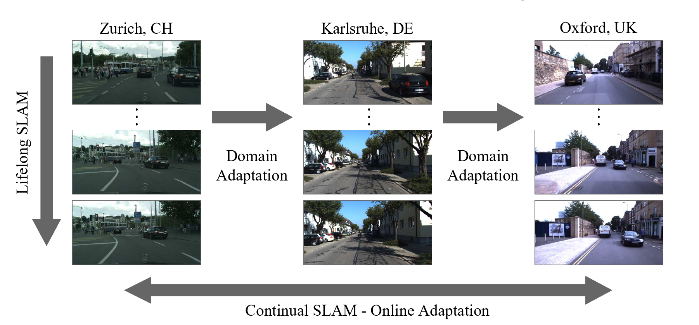
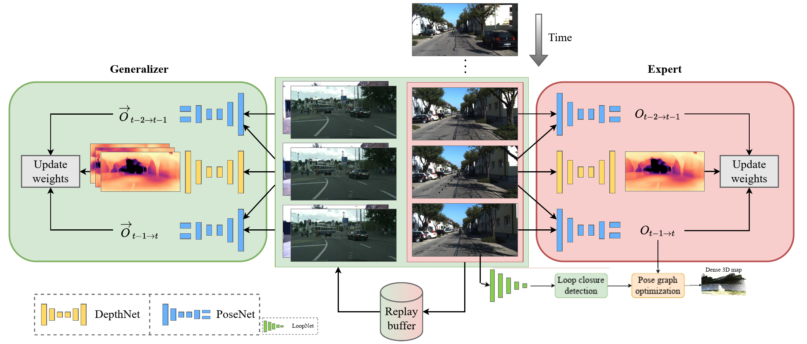

class: center, middle

# Reviewing CL-SLAM

Niclas Vödisch, Daniele Cattaneo, Wolfram Burgard, and Abhinav Valada

"Beyond Lifelong Simultaneous Localization and Mapping through Continual Learning"

IEEE/CVF Conference on Computer Vision and Pattern Recognition (CVPR) Workshops, 2023.

[arXiv:2203.01578](https://arxiv.org/abs/2203.01578)

---

# Agenda

1. Motivation

2. Goals

3. Proposed Solution
   * Architecture
   * Implementation

4. Review

---

# Motivation

Challenges in SLAM

* Handcrafted low-level features tend to fail in challenging conditions

* DL based approaches lack the ability to generalize

* Domain gap between environments

* Sudden changes to an environment

---

## Motivation and Definitions

* Environment := bounded geographical area

* Lifelong SLAM := Constrained to stay within a (changing) environment

* Domain Adaption := Uni-directional knowledge transfer between environments

---

# Goals

1. React to sudden changes without interrupting operation

2. Adapt without ground truth data in a unsupervised or self-supervised manner

3. Deploy to many unknown environments and revisit previous deployments

---

# Proposed Solution

Continual Learning and Lifelong SLAM (CL-SLAM)

## Related work

* SfMLearner and Monodepth2: Self-supervised visual odometry and depth estimation

* DeepSLAM: Unsupervised VO with pose graph optimization and loop closure

---

## Architecture

* Generalizer and Expert have own independent instances of depth- and pose-network (one each)

* Expert performs online adaption and predicted results are sent to the SLAM framework

* Generalizer avoids catastrophic forgetting employing a replay buffer of seen samples

---

## Implementation

* [pose_decoder.py](https://github.com/robot-learning-freiburg/CL-SLAM/blob/main/depth_pose_prediction/networks/pose_decoder.py)
  * Pose network with velocity supervision
  * Adopted from Monodepth2
  * Encoder based on ResNet

* [depth_decoder.py](https://github.com/robot-learning-freiburg/CL-SLAM/blob/main/depth_pose_prediction/networks/depth_decoder.py)
  * Predicts disparity / inverse depth
  * Adopted from Monodepth2
  * Encoder based on ResNet

* [loop_closure_detection.py](https://github.com/robot-learning-freiburg/CL-SLAM/blob/main/loop_closure_detection/loop_closure_detection.py)
  * Builds index using [faiss](https://faiss.ai/)
  * Encoder based on mobilenet_v3_small

* [replay_buffer.py](https://github.com/robot-learning-freiburg/CL-SLAM/blob/main/slam/replay_buffer.py)
  * Maintains collection of dissimilar samples
  * Uses own instance of loop closure's encoder and index

* [pose_graph_optimization.py](https://github.com/robot-learning-freiburg/CL-SLAM/blob/main/slam/pose_graph_optimization.py) (based on g2o.SparseOptimizer)